# soal-shift-sisop-modul-3-IT08-2021

#

1. Tri Rizki Yuliawan (05311940000024)
2. Tera Nurwahyu Pratama (05311940000039)
3. Justin Alfonsius Sitanggang (05311840000043)

#

#

- [Soal 1](#soal1)
- [Soal 2](#soal2)
  - [Soal 2A](#soal-2a)
  - [Soal 2B](#soal-2b)
  - [Soal 2C](#soal-2c)
- [Soal 3](#soal3)

#

# Soal1

# Soal2

Crypto (kamu) adalah teman Loba. Suatu pagi, Crypto melihat Loba yang sedang kewalahan mengerjakan tugas dari bosnya. Karena Crypto adalah orang yang sangat menyukai tantangan, dia ingin membantu Loba mengerjakan tugasnya. Detil dari tugas tersebut adalah:

- Membuat program perkalian matrix (4x3 dengan 3x6) dan menampilkan hasilnya. Matriks nantinya akan berisi angka 1-20 (tidak perlu dibuat filter angka).

- Membuat program dengan menggunakan matriks output dari program sebelumnya (program soal2a.c) (Catatan!: gunakan shared memory). Kemudian matriks tersebut akan dilakukan perhitungan dengan matrix baru (input user) sebagai berikut contoh perhitungan untuk matriks yang a da. Perhitungannya adalah setiap cel yang berasal dari matriks A menjadi angka untuk faktorial, lalu cel dari matriks B menjadi batas maksimal faktorialnya matri(dari paling besar ke paling kecil) (Catatan!: gunakan thread untuk perhitungan di setiap cel). Ketentuan :

```
If a >= b  -> a!/(a-b)!
If b > a -> a!
If 0 -> 0
```

- Karena takut lag dalam pengerjaannya membantu Loba, Crypto juga membuat program (soal2c.c) untuk mengecek 5 proses teratas apa saja yang memakan resource komputernya dengan command “ps aux | sort -nrk 3,3 | head -5” (Catatan!: Harus menggunakan IPC Pipes)

## Note

- Semua matriks berasal dari input ke program.
- Dilarang menggunakan system()

## Pengerjaan Soal 2

### Soal 2A

- Pertama, kita deklarasikan key, value dan shmid dimana variable value adalah variable yang akan dipakai bersama.

```C
key_t key = 1234;
int *value;
int shmid = shmget(key, sizeof(int)*row*col, IPC_CREAT | 0666);
value = shmat(shmid, NULL, 0);
```

- Lalu kita deklarasikan juga ukuran matriksnya dan juga variable lainnya yang akan digunakan.

```C
int m, n, p, q, c, d, k, sum = 0;
printf("");
int first[4][3];
int second[3][6];
printf("");
int multiply[row][col];
int i = 0, j = 0;
```

- Dengan menggunakan perulangan do, while kita melakukan input nilai untuk setiap sel matriks nya. Setelah itu lakukan perkalian terhadap 2 matriks tersebut dan disimpan ke variable value menjadi 1 dimensi.

```C
do{
	while(j < 3){
		scanf("%d", &first[i][j]);
		j++;
	}
	j = 0;
	i++;
}while(i < 4);

i = 0;
j = 0;
while(i < 3){
	do{
		scanf("%d", &second[i][j]);
		j++;
	}while(j < 6);
	j = 0;
	i++;
}

for (c = 0; c < row; c++) {
	for (d = 0; d < col; d++) {
		for (k = 0; k < 3; k++) {
			sum = sum + first[c][k] * second[k][d];
		}
		multiply[c][d] = sum;
		sum = 0;
	}
}

for (c = 0; c < row; c++) {
	for (d = 0; d < col; d++) {
		value[c*col+d] = multiply[c][d];
		printf("%4d",multiply[c][d]);
	}
	printf("\n");
}
```

- Lalu kita lepas shared memory dengan menggunakan fungsi shmdt dan saya gunakan sleep(30).

```C
sleep(30);
shmdt(value);
```

### Soal 2B

- Pertama saya buat sebuah struct dengan 2 variable didalamnya dan juga matrixB dengan ukuran row\*col untuk menyimpan matriks B dan juga variable counter untuk mengiterasi setiap data yang ada di matriks B nantinya

```C
typedef struct data {
	int angka;
	unsigned long long hasil;
}data;

int matrixB[row*col];
int counter;
```

- Lalu terdapat fungsi faktorial dengan tipe unsigned long long untuk melakukan perhitungan faktorial yang menerima 1 parameter dan akan mengembalikan sebuah nilai faktorial nantinya.

```C
unsigned long long faktorial(unsigned long long a){
    int pembilang = 1, penyebut = 1;
    unsigned long long ans = 0;

    if(a == 0 && matrixB[counter] == 0){
        counter++;
        return 0;
    }
    else if (a >= matrixB[counter]){
        for(int i = a; i > 0; i--){
            pembilang *= i;
        }
        for(int j = a-matrixB[counter]; j > 0; j--){
            if (j == 0){
                penyebut = 1;
                break;
            }
            penyebut *= j;
        }
        ans = pembilang/penyebut;
        counter++;
        return ans;
    }else if (matrixB[counter] > a){
        for(int i = a; i > 0; i--){
            pembilang *= i;
        }
        ans = pembilang;
        counter++;
        return ans;
    }
}

void *fact(void* arg)
{
	data* d = (data*) arg;
    d->hasil=faktorial(d->angka);
}
```

- Terdapat juga variable value yang akan digunakan sebagai shared memory dan juga variable untuk melakukan thread pada perhitungan setiap sel di matriks

```C
    key_t key = 1234;
	int *value;
	int shmid = shmget(key, sizeof(int), IPC_CREAT | 0666);
	value = shmat(shmid, NULL, 0);

	pthread_t tid[row*col];
	data d[row*col];
```

- Untuk mengambil matriks dari soal 2A sebelumnya kita gunakan perulangan untuk mengambil variable value

```C
    i = 0;
    j = 0;

    printf("\n");
    //Menampilkan Matrix dari 2a
    printf("Isi dari Matrix A: ");
    printf("\n");
    do{
        d[i].angka = value[i];
        if (i % 6 == 0) printf("\n");
        printf("%4d", value[i]);
        i++;
    }while(i < row*col);
```

- Kita lakukan perulangan lagi untuk membuat thread untuk menjalankan fungsi fact

```C
    i = 0;
    while(i < row*col){
        d[i].angka = value[i];
        pthread_create(&tid[i],NULL, &fact, (void*) &d[i]);
        i++;
    }
```

- Lalu kita tampilkan hasil final matriks lalu menggunakan thread join dan terakhir kita lakukan pelepasan shared memory dengan fungsi shmdt dan shmct

```C
    i = 0;
    printf("\n");
    printf("\n");
    printf("Isi dari Final Matrix: ");
    printf("\n");
    i = 0;

	for(i = 0; i< row*col; i++)
	{
		if (i % 6 == 0) printf("\n");
		printf("%llu\t", d[i].hasil);
        pthread_join(tid[i],NULL);
	}


	printf("\n");

	shmdt(value);
	shmctl(shmid, IPC_RMID, NULL);
```

### Soal 2C

- Pertama kita buat 2 pipe dan variable child dan melakukan pengecekan apakah berhasil membuat pipe atau tidak

```C
    int main(){
    int p1[2];
    int p2[2];
    pid_t pp, child_id;
    if(pipe(p1) == -1)
    {
        printf("");
        fprintf(stderr, "pipe failed");
        printf("\n");
        return 1;
    }
    if(pipe(p2) == -1)
    {
        printf("");
        fprintf(stderr, "pipe failed");
        printf("\n");
        return 1;
    }
```

- Kita buat sebuah proses baru dengan melakukan fork(), pada child proses kita lakukan proses ps aux dan hasil dari ps aux tersebut disimpan di pipe pertama, lalu pada parent proses kita buat proses baru lagi sehingga menghasilkan child baru. pada child baru kita lakukan sort -nrk 3,3 lalu hasil dari sort tersebut kita simpan di pipe kedua dan pada parent proses terakhir kita tutup pipe 1 dan pipe 2 lalu kita lakukan head -5.

```C
    pp = fork();
    if(pp < 0){
        printf("");
        fprintf(stderr, "fork failed");
        printf("\n");
        exit(EXIT_FAILURE);
    }
    if(pp == 0){
        close(p1[0]);
        dup2(p1[1], STDOUT_FILENO);
        char *argv[] = {"ps", "aux", NULL};
        execv("/bin/ps", argv);
        exit(EXIT_SUCCESS);
    }else{
        wait(NULL);
        child_id = fork();
        if(child_id < 0){
            printf("gagal");
            printf("\n");
            exit(EXIT_FAILURE);
        }
        if(child_id == 0){
            close(p1[1]);
            dup2(p1[0], STDIN_FILENO);
            close(p2[0]);
            dup2(p2[1], STDOUT_FILENO);
            char *argv[] = {"sort", "-nrk 3,3", NULL};
            execv("/usr/bin/sort", argv);
            exit(EXIT_SUCCESS);
        }else{
            close(p2[1]);
            dup2(p2[0], STDIN_FILENO);
            close(p1[1]);
            close(p1[0]);
            char *argv[] = {"head", "-5", NULL};
            execv("/usr/bin/head", argv);
            exit(EXIT_SUCCESS);
        }
    }
```

## Kendala yang dihadapi:

Pada perhitungan matriks awalnya tidak urut tapi sekarang sudah bisa urut. Terdapat revisi sedikit pada fungsi faktorial karena ada beberapa case yang salah namun sekarang sudah benar.

## Revisi

- Pada soal 2B di bagian fungsi faktorial terdapat kesalahan rumus namun sudah direvisi.

## Screenshot Hasil

- Hasil Run Soal 2A
  <br>
  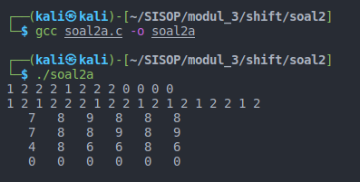
- Hasil Run Soal 2B
  <br>
  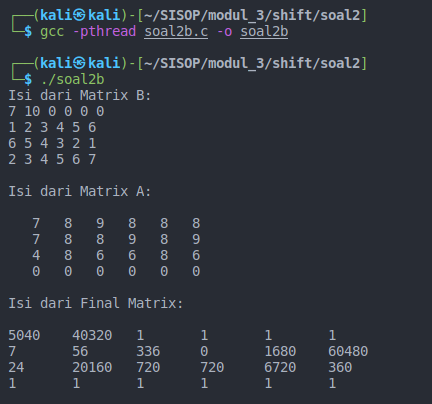
  <br>
- Hasil Run Soal 2C
  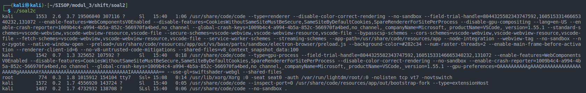

# Soal3

Seorang mahasiswa bernama Alex sedang mengalami masa gabut. Di saat masa gabutnya, ia memikirkan untuk merapikan sejumlah file yang ada di laptopnya. Karena jumlah filenya terlalu banyak, Alex meminta saran ke Ayub. Ayub menyarankan untuk membuat sebuah program C agar file-file dapat dikategorikan. Program ini akan memindahkan file sesuai ekstensinya ke dalam folder sesuai ekstensinya yang folder hasilnya terdapat di working directory ketika program kategori tersebut dijalankan.

Contoh apabila program dijalankan:

```
# Program soal3 terletak di /home/izone/soal3
$ ./soal3 -f path/to/file1.jpg path/to/file2.c path/to/file3.zip
#Hasilnya adalah sebagai berikut
/home/izone
|-jpg
    |--file1.jpg
|-c
    |--file2.c
|-zip
    |--file3.zip
```

- Program menerima opsi -f seperti contoh di atas, jadi pengguna bisa menambahkan argumen file yang bisa dikategorikan sebanyak yang diinginkan oleh pengguna.
  Output yang dikeluarkan adalah seperti ini :

```
File 1 : Berhasil Dikategorikan (jika berhasil)
File 2 : Sad, gagal :( (jika gagal)
File 3 : Berhasil Dikategorikan
```

- Program juga dapat menerima opsi -d untuk melakukan pengkategorian pada suatu directory. Namun pada opsi -d ini, user hanya bisa memasukkan input 1 directory saja, tidak seperti file yang bebas menginput file sebanyak mungkin. Contohnya adalah seperti ini:

```
$ ./soal3 -d /path/to/directory/
```

Perintah di atas akan mengkategorikan file di /path/to/directory, lalu hasilnya akan disimpan di working directory dimana program C tersebut berjalan (hasil kategori filenya bukan di /path/to/directory).
Output yang dikeluarkan adalah seperti ini :

```
Jika berhasil, print “Direktori sukses disimpan!”
Jika gagal, print “Yah, gagal disimpan :(“
```

- Selain menerima opsi-opsi di atas, program ini menerima opsi \*, contohnya ada di bawah ini:

```
$ ./soal3 \*
```

Opsi ini akan mengkategorikan seluruh file yang ada di working directory ketika menjalankan program C tersebut.

- Semua file harus berada di dalam folder, jika terdapat file yang tidak memiliki ekstensi, file disimpan dalam folder “Unknown”. Jika file hidden, masuk folder “Hidden”.

- Setiap 1 file yang dikategorikan dioperasikan oleh 1 thread agar bisa berjalan secara paralel sehingga proses kategori bisa berjalan lebih cepat.

Namun karena Ayub adalah orang yang hanya bisa memberi ide saja, tidak mau bantuin buat bikin programnya, Ayub meminta bantuanmu untuk membuatkan programnya. Bantulah agar program dapat berjalan!

Catatan:

- Kategori folder tidak dibuat secara manual, harus melalui program C
- Program ini tidak case sensitive. Contoh: JPG dan jpg adalah sama
- Jika ekstensi lebih dari satu (contoh “.tar.gz”) maka akan masuk ke folder dengan titik terdepan (contoh “tar.gz”)
- Dilarang juga menggunakan fork-exec dan system()
- Bagian b dan c berlaku rekursif

## Pengerjaan Soal 3

- Pertama kita deklarasikan beberapa variable global dan juga beberapa fungsi yang akan digunakan serta sebuah konstanta MAX_SIZE sebesar 256.

```C
#define MAX_SIZE 256

char cwd[MAX_SIZE];
int check;
int iter = 0;
int once = 0;

int isDirectory(const char *myPath);

void *pindahFile(void *filename);
```

- Pertama kita cek argumen yang dimasukkan oleh user sudah benar atau tidak

```C
int main(int argc, char **argv)
{
  if (argc < 2)
  {
    puts("Masukan argumen dengan benar (-d / -f / *)");
    return 0;
  }
```

- Lalu kita ambil direktori sekarang atau current working directory dengan fungsi getcwd

```C
getcwd(cwd, sizeof(cwd));
```

- Jika fungsi yang diminta adalah fungsi "-f" kita akan menghitung berapa banyak file yang diminta dengan cara argc-2, lalu hasilnya akan digunakan sebagai batas untuk perulangan. Di dalam perulangan tersebut akan menjalankan fungsi "pindahFile" dengan menggunakan thread untuk setiap filenya. Lalu diakhir program akan ada pthread_join agar file dapat dipindahkan secara urut

```C
if (strcmp(argv[1], "-f") == 0)
  {
    check = 0;
    printf("");
    pthread_t myThreads[argc - 2];
    int i = 2;
    while(i < argc){

      // Jika direktori, maka ga bisa
      if(isDirectory(argv[i])){
        printf("%s adalah direktori\n", argv[i]);
      }
      else{
        // Create pthread
        pthread_create(&myThreads[i-2], NULL, pindahFile, argv[i]);
      }

      i++;
    }

    // join pthread
    i = 0;
    while(i < argc-2){
      pthread_join(myThreads[i], NULL);
      i++;
    }

  }
```

- Fungsi untuk memindahkan file, pertama kita ambil nama file yang ingin diproses, lalu dari file tersebut akan diambil ekstensinya. Setelah itu kita buat path baru untuk file tersebut dengan tambahan ekstensi yang baru didapat tadi. Lalu kita read file tersebut untuk mengetes apakah file tersebut ada atau tidak, jika ada maka kita buat folder tujuan dan mengoutputkan "File Berhasil Dikategorikan", jika tidak maka akan akan output "File sad gagal :(". Lalu kita tutup file tersebut

```C
void *pindahFile(void *filename)
{
  // Deklarasi nilai sumber
  char *sumber = (char *)filename;
  char sumberBaru[MAX_SIZE];
  strcpy(sumberBaru, sumber);

  // Deklarasi nilai target
  char *target = strrchr(sumberBaru, '/');
  char namaFileBaru[MAX_SIZE];

  if(target){
    strcpy(namaFileBaru, target + 1);
  }
  else{
    strcpy(namaFileBaru, sumberBaru);
  }

  const char *dot = strrchr(namaFileBaru, '.');
  struct stat st = {0};
  char folder[MAX_SIZE];

  if(!dot || dot == sumberBaru){
    strcpy(folder, "Unknown");
  }
  else
  {
    strcpy(folder, dot + 1);
    int i = 0;
    while(folder[i]!='\0')
    {
      if(folder[i]>='A' && folder[i]<='Z')
        folder[i] += 32;
      i++;
    }
  }

  // Mulai processing file
  int ch;
  FILE *file1, *file2;

  if(!target){
    target = sumberBaru;
  }
  else{
    target = target + 1;
  }

  // Deklarasi variabel targetBaru
  char targetBaru[MAX_SIZE];
  sprintf(targetBaru, "%s/%s/%s", cwd, folder, target);

  // untuk cek apakah akses file error
  int x1 = 0,y1 = 0;

  file1 = fopen(sumberBaru, "r");

  if (!file1)
  {
    printf("Tidak bisa dibuka :( %s!\n", sumberBaru);
    x1 = 1;
    pthread_exit(NULL);
    return NULL;
  }

  if (stat(folder, &st) == -1)
    mkdir(folder, 0700);

  file2 = fopen(targetBaru, "w");

  if (!file2)
  {
    printf("Tidak bisa dibuka :( %s!\n", targetBaru);
    y1 = 1;
    pthread_exit(NULL);
    return NULL;
  }

  while ((ch = fgetc(file1)) != EOF){
    fputc(ch, file2);
  }

  // check menandakan dia program pertama (-f) atau kedua (-d)
  if (check == 0)
  {
    iter++;
    // jika gagal, print gagal
    if (x1 == 1 || y1 == 1) {
      printf("File %d: Sad, gagal :(\n", iter);
    } else {
      printf("File %d: Berhasil Dikategorikan\n", iter);
    }
  } else {
    if (once == 0) {
      once = 1;
      if (x1 == 1 || y1 == 1) {
        printf("Yah, gagal disimpan :(\n");
      } else {
        printf("Direktori sukses disimpan\n");
      }
    }
  }

  //close file
  fclose(file1);
  fclose(file2);

  //remove new sumber nya
  remove(sumberBaru);

  //exit pthread
  pthread_exit(NULL);

}
```

- Fungsi untuk mengecek apakah file sebuah folder atau tidak

```C
int isDirectory(const char *myPath)
{
  struct stat myPath_stat;
  stat(myPath, &myPath_stat);
  return S_ISDIR(myPath_stat.st_mode);
}
```

- Jika fungsi yang diminta adalah fungsi "-d" maka kita akan menerima sebuah path directory yang akan dikategorikan. Lalu kita buka folder tersebut dan melakukan directory listing secara rekursi. Untuk setiap file yang ditemukan akan dilakukan fungsi pindahFile, setelah itu ada pthread_join agar file dapat dijalankan secara berurutan

```C
else if (strcmp(argv[1], "-d") == 0 && argc == 3)
  {
    // Ini program kedua (-d)
    printf("");
    check = 1;
    int banyakFile = 0;
    char files[MAX_SIZE][MAX_SIZE];

    DIR *d;
    struct dirent *dir;
    chdir(argv[2]);
    d = opendir(".");

    if (d)
    {
      while ((dir = readdir(d)) != NULL)
      {
        if(strcmp(dir->d_name, ".") == 0 || strcmp(dir->d_name, "..") == 0){
          continue;
        }

        // Jika direktori, maka ga bisa
        if(isDirectory(dir->d_name))
        {
          printf("%s adalah direktori\n", dir->d_name);
        }
        else
        {
          char tmp[100];
          strcpy(tmp, dir->d_name);
          sprintf(files[banyakFile], "%s/%s", argv[2], dir->d_name);
          banyakFile++;
        }
      }
      closedir(d);
    }

    chdir(cwd);
    pthread_t myThreads[banyakFile];

    // create pthread
    int i = 0;
    while(i < banyakFile){
      pthread_create(&myThreads[i], NULL, pindahFile, files[i]);
      i++;
    }

    // join pthread
    i = 0;
    while(i < banyakFile){
      pthread_join(myThreads[i], NULL);
      i++;
    }

  }
```

- Jika fungsi yang diminta adalah fungsi "\*" maka folder yang akan dikategorikan adalah folder di "current working directory". Setelah itu kita lakukan rekursi seperti fungsi "-d" setelah file ditemukan maka file" tersebut akan dijalankan dengan fungsi "pindahFile" dan diakhir program akan ada pthread_join agar file yang dijalankan dapat berjalan secara berurutan

```C
else if (strcmp(argv[1], "*") == 0 && argc == 2)
  {
    // Ini program ketiga (\*)
    printf("");
    int banyakFile = 0;
    char files[MAX_SIZE][MAX_SIZE];

    DIR *d;
    struct dirent *dir;
    d = opendir(".");

    if (d)
    {
      while ((dir = readdir(d)) != NULL)
      {
        if(strcmp(dir->d_name, ".") == 0 || strcmp(dir->d_name, "..") == 0){
          continue;
        }

        // Jika direktori, maka ga bisa
        if(isDirectory(dir->d_name))
        {
          printf("%s adalah direktori\n", dir->d_name);
        }
        else
        {
          char tmp[100];
          strcpy(tmp, dir->d_name);
          sprintf(files[banyakFile], "%s", dir->d_name);
          banyakFile++;
        }
      }
      closedir(d);

    }

    pthread_t myThreads[banyakFile];
    int i = 0;
    // create pthread
    while(i < banyakFile){
      pthread_create(&myThreads[i], NULL, pindahFile, files[i]);
      i++;
    }

    // join pthread
    i = 0;
    while(i < banyakFile){
      pthread_join(myThreads[i], NULL);
      i++;
    }

  }
```

## Kendala yang dihadapi

Pada awalnya saya sudah bisa membuat semua fungsi dengan benar hanya saja untuk fungsi "-d" dan "\*" harus bersifat rekursi. Nah pada awalnya saya belum bisa membuat nya secara rekursi sehingga hanya dapat mengoperasikan file dengan tingkat 1 (tidak bisa folder->folder->file). Namun setelah revisi saya melihat referensi codingan teman saya dan berhasil mengaplikasikannya pada program saya

## Revisi

- Perbaikan pada fungsi "-d" dan juga "\*" yang sebelumnya tidak bersifat rekursi sekarang sudah bisa rekursi.

## Screenshot Hasil

- Hasil run fungsi "-f"
  <br>
  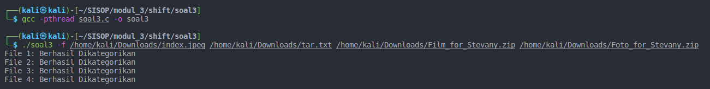
  <br>
  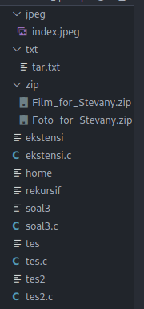
- Hasil run fungsi "-d"
  <br>
  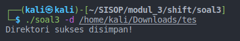
  <br>
  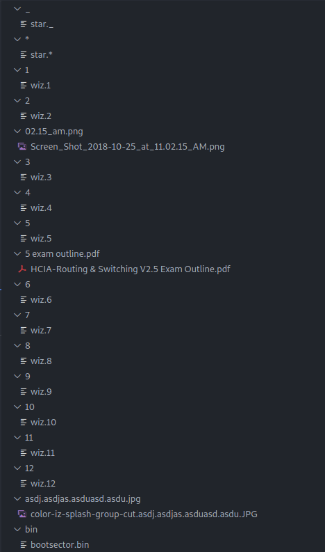
  <br>
  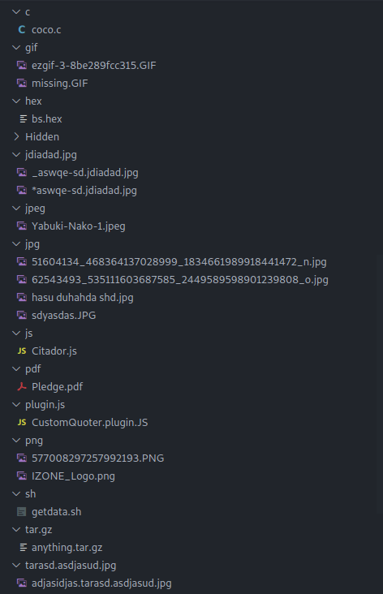
  <br>
  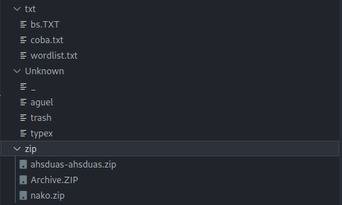
- Hasil run fungsi "\*"
  <br>
  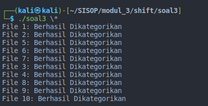
  <br>
  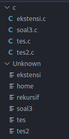
