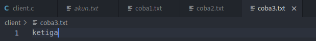

# soal-shift-sisop-modul-3-IT08-2021

#

1. Tri Rizki Yuliawan (05311940000024)
2. Tera Nurwahyu Pratama (05311940000039)
3. Justin Alfonsius Sitanggang (05311840000043)

#

#

- [Soal 1](#soal1)
  - [Soal 1A](#soal-1a)
  - [Soal 1B](#soal-1b)
  - [Soal 1C](#soal-1c)
  - [Soal 1D](#soal-1d)
  - [Soal 1E](#soal-1e)
  - [Soal 1F](#soal-1f)
  - [Soal 1G](#soal-1g)
  - [Soal 1H](#soal-1h)
- [Soal 2](#soal2)
  - [Soal 2A](#soal-2a)
  - [Soal 2B](#soal-2b)
  - [Soal 2C](#soal-2c)
- [Soal 3](#soal3)

#

# Soal1

Keverk adalah orang yang cukup ambisius dan terkenal di angkatannya. Sebelum dia menjadi ketua departemen di HMTC, dia pernah mengerjakan suatu proyek dimana keverk tersebut meminta untuk membuat server database buku. Proyek ini diminta agar dapat digunakan oleh pemilik aplikasi dan diharapkan bantuannya dari pengguna aplikasi ini.</br>
</br>
Di dalam proyek itu, Keverk diminta: </br>

### Soal 1A

Pada saat client tersambung dengan server, terdapat dua pilihan pertama, yaitu register dan login. Jika memilih register, client akan diminta input id dan passwordnya untuk dikirimkan ke server. User juga dapat melakukan login. Login berhasil jika id dan password yang dikirim dari aplikasi client sesuai dengan list akun yang ada didalam aplikasi server. Sistem ini juga dapat menerima multi-connections. Koneksi terhitung ketika aplikasi client tersambung dengan server. Jika terdapat 2 koneksi atau lebih maka harus menunggu sampai client pertama keluar untuk bisa melakukan login dan mengakses aplikasinya. Keverk menginginkan lokasi penyimpanan id dan password pada file bernama akun.txt dengan format :

<b>akun.txt</b></br>

> id:password </br>
> id2:password2

### Soal 1B

Sistem memiliki sebuah database yang bernama files.tsv. Isi dari files.tsv ini adalah path file saat berada di server, publisher, dan tahun publikasi. Setiap penambahan dan penghapusan file pada folder file yang bernama FILES pada server akan memengaruhi isi dari files.tsv. Folder FILES otomatis dibuat saat server dijalankan.

### Soal 1C

Tidak hanya itu, Keverk juga diminta membuat fitur agar client dapat menambah file baru ke dalam server. Direktori FILES memiliki struktur direktori di bawah ini :

Direktori <b>FILES</b>

> File1.ekstensi </br>
> File2.ekstensi

Pertama client mengirimkan input ke server dengan struktur sebagai berikut :</br>
Contoh Command Client :

> add

Output Client Console:

> Publisher: </br>
> Tahun Publikasi:</br>
> Filepath:

Kemudian, dari aplikasi client akan dimasukan data buku tersebut (perlu diingat bahwa Filepath ini merupakan path file yang akan dikirim ke server). Lalu client nanti akan melakukan pengiriman file ke aplikasi server dengan menggunakan socket. Ketika file diterima di server, maka row dari files.tsv akan bertambah sesuai dengan data terbaru yang ditambahkan.

### Soal 1D

Dan client dapat mendownload file yang telah ada dalam folder FILES di server, sehingga sistem harus dapat mengirim file ke client. Server harus melihat dari files.tsv untuk melakukan pengecekan apakah file tersebut valid. Jika tidak valid, maka mengirimkan pesan error balik ke client. Jika berhasil, file akan dikirim dan akan diterima ke client di folder client tersebut.

Contoh Command client

> download TEMPfile.pdf

### Soal 1E

Setelah itu, client juga dapat menghapus file yang tersimpan di server. Akan tetapi, Keverk takut file yang dibuang adalah file yang penting, maka file hanya akan diganti namanya menjadi ‘old-NamaFile.ekstensi’. Ketika file telah diubah namanya, maka row dari file tersebut di file.tsv akan terhapus.

Contoh Command Client:

> delete TEMPfile.pdf

### Soal 1F

Client dapat melihat semua isi files.tsv dengan memanggil suatu perintah yang bernama see. Output dari perintah tersebut keluar dengan format.

Contoh Command Client :

> see

Contoh Format Output pada Client:

> Nama:<br>
> Publisher: <br>
> Tahun publishing:<br>
> Ekstensi File : <br>
> Filepath : <br>

> Nama: <br>
> Publisher: <br>
> Tahun publishing: <br>
> Ekstensi File : <br>
> Filepath : <br>

### Soal 1G

Aplikasi client juga dapat melakukan pencarian dengan memberikan suatu string. Hasilnya adalah semua nama file yang mengandung string tersebut. Format output seperti format output f.

Contoh Client Command:

> find TEMP

### Soal 1H

Dikarenakan Keverk waspada dengan pertambahan dan penghapusan file di server, maka Keverk membuat suatu log untuk server yang bernama running.log. Contoh isi dari log ini adalah

<b>running.log</b></br>

> Tambah : File1.ektensi (id:pass)</br>
> Hapus : File2.ektensi (id:pass)

Akan tetapi, kevek saat itu masih belum paham dengan sistem server dan client.

Bantulah Keverk untuk menyelesaikan proyek ini!

### <b>Note:</b>

- Dilarang menggunakan system() dan execv(). Silahkan dikerjakan sepenuhnya dengan thread dan socket programming.
- Untuk download dan upload silahkan menggunakan file teks dengan ekstensi dan isi bebas (yang ada isinya bukan touch saja dan tidak kosong) dan requirement untuk benar adalah percobaan dengan minimum 5 data.

Struktur Direktori:

> ├── Client</br>
> │ ... ├── client.c</br>
> │ ... ├── File2.extensi</br>
> │ ... └── File1.extensi</br>
> └── Server</br>
> ...... ├── akun.txt</br>
> ...... ├── files.tsv</br>
> ...... ├── server.c</br>
> ...... ├── running.log</br>
> ...... └── FILES</br>

     ..............       ├── File2.extensi</br>
    ..............       └── File1.ekstensi</br>

## Pengerjaan Soal 1

### Pada Server

- Mendefinisikan port server dan juga max client, dan juga id dan pass untuk login dan register nya nanti.

```C
#define PORT 1222
#define MAX_CLIENTS 1000

pthread_t tid[MAX_CLIENTS];

int login = 0;
pthread_t login_client_id;
char id_login[100] = {0};
char pass_login[100] = {0};
```

- Membuat command see untuk memunculkan semua file yang ada. Dimana output yang ditampilkan terdapat nama filesnya, publisher, tahun publikasi file dan filepathnya.

```C
          if(state == 5){
            FILE *filein;
            filein = fopen("files.tsv","r");

            char temp[1000] = {0};
            char filepath[100] = {0},publisher[100] = {0},tahun[100] = {0},nama[100] = {0},ekstensi[100] = {0};

            while((fscanf(filein,"%[^\n]%*c",temp)) != EOF){
                    char *token = strtok(temp,"\t");
                    if(token != NULL){
                        strcpy(filepath,token);
                        token = strtok(NULL,"\t");
                    }
                    if(token !=NULL){
                        strcpy(publisher,token);
                        token = strtok(NULL,"\t");
                    }

                    if(token !=NULL){
                        strcpy(tahun,token);
                    }

                    token = strtok(temp,"/");
                    token = strtok(NULL,".");
                    strcpy(nama, token);
                    token = strtok(NULL,".");
                    strcpy(ekstensi,token);

                    strcpy(message,"Nama: ");
                    strcat(message,nama);
                    strcat(message,"\n");
                    strcat(message,"Publisher: ");
                    strcat(message,publisher);
                    strcat(message,"\n");
                    strcat(message,"Tahun publishing: ");
                    strcat(message,tahun);
                    strcat(message,"\n");
                    strcat(message,"Ekstensi: ");
                    strcat(message,ekstensi);
                    strcat(message,"\n");
                    strcat(message,"Filepath: ");
                    strcat(message,filepath);
                    strcat(message,"\n");
                    send(*new_socket , message , strlen(message) , 0 );

                    valread = recv( *new_socket , buffer, 1000, 0);

            }
            strcpy(message,"DONE!!!");
            send(*new_socket , message , strlen(message) , 0 );
            valread = recv( *new_socket , buffer, 1000, 0);

            fclose(filein);
            state = 1;
        }
```

- fungsi find untuk mencari file di server

```C
              ret = strstr(buffer, "find");
                if(ret){
                    char *token = strtok(buffer," ");
                    while(token != NULL){
                        strcpy(parameter[ind],token);
                        ind++;
                        token = strtok(NULL," ");
                    }
                    state = 6;
                }
```

```C
          if(state == 6){
            FILE *filein;
            filein = fopen("files.tsv","r");

            char temp[1000] = {0};
            char filepath[100] = {0},publisher[100] = {0},tahun[100] = {0},nama[100] = {0},ekstensi[100] = {0};

            while((fscanf(filein,"%[^\n]%*c",temp)) != EOF){
                    char *token = strtok(temp,"\t");
                    if(token != NULL){
                        strcpy(filepath,token);
                        token = strtok(NULL,"\t");
                    }
                    if(token !=NULL){
                        strcpy(publisher,token);
                        token = strtok(NULL,"\t");
                    }

                    if(token !=NULL){
                        strcpy(tahun,token);
                    }

                    token = strtok(temp,"/");
                    token = strtok(NULL,".");
                    strcpy(nama, token);
                    token = strtok(NULL,".");
                    strcpy(ekstensi,token);

                    char *ret =strstr(filepath,parameter[1]);

                    if(ret){
                        strcpy(message,"Nama: ");
                        strcat(message,nama);
                        strcat(message,"\n");
                        strcat(message,"Publisher: ");
                        strcat(message,publisher);
                        strcat(message,"\n");
                        strcat(message,"Tahun publishing: ");
                        strcat(message,tahun);
                        strcat(message,"\n");
                        strcat(message,"Ekstensi: ");
                        strcat(message,ekstensi);
                        strcat(message,"\n");
                        strcat(message,"Filepath: ");
                        strcat(message,filepath);
                        strcat(message,"\n");
                        send(*new_socket , message , strlen(message) , 0 );

                        valread = recv( *new_socket , buffer, 1000, 0);
                    }

            }
            strcpy(message,"DONE!!!");
            send(*new_socket , message , strlen(message) , 0 );
            valread = recv( *new_socket , buffer, 1000, 0);

            fclose(filein);
            state = 1;
        }
```

- Fungsi register untuk mendaftar akun dengan mengisikan id dan password user

```C
          if(state == 0){
            strcpy(message,"1.Register\n2.Login\nInput>>");
            send(*new_socket , message , strlen(message) , 0);
            valread = recv( *new_socket , buffer, 1024, 0);
            if(checkClose(valread,new_socket)){
                break;
            };
            if(strcmp(buffer,"1") == 0){
                strcpy(message,"Registrasi\nID >>");
                send(*new_socket , message , strlen(message) , 0);
                char id[100] = {0};
                char password[100] = {0};
                valread = recv( *new_socket , id, 100, 0);
                if(checkClose(valread,new_socket)){
                    break;
                };


                strcpy(message,"Password >>");
                send(*new_socket , message , strlen(message) , 0);
                valread = recv( *new_socket , password, 100, 0);
                if(checkClose(valread,new_socket)){
                    break;
                };

                FILE *fileout;
                fileout = fopen("akun.txt", "a");
                char concat[200] = {0};
                strcpy(concat,id);
                strcat(concat,":");
                strcat(concat,password);
                fputs(concat,fileout);
                fputs("\n",fileout);
                fclose(fileout);

                printf("Data berhasil disimpan\n");
          }
```

- Fungsi Login untuk login dengan akun yang sudah terdaftar

```C
              else if(strcmp(buffer,"2") == 0){
                strcpy(message,"Login\nID >>");
                send(*new_socket , message , strlen(message) , 0);

                char id[100] = {0};
                char password[100] = {0};
                valread = recv( *new_socket , id, 100, 0);
                if(checkClose(valread,new_socket)){
                    break;
                };


                strcpy(message,"Password >>");
                send(*new_socket , message , strlen(message) , 0);
                valread = recv( *new_socket , password, 100, 0);
                if(checkClose(valread,new_socket)){
                    break;
                };

                FILE *filein;
                filein = fopen("akun.txt","r");
                char temp[100] = {0};
                char tempId[100] = {0};
                char tempPassword[100] = {0};
                bool found = false;
                while((fscanf(filein,"%[^\n]%*c",temp)) != EOF){
                    char *token = strtok(temp,":");
                    if(token != NULL){
                        strcpy(tempId,token);
                        token = strtok(NULL,":");
                    }

                    if(token != NULL){
                        strcpy(tempPassword,token);
                    }
                    if(strcmp(id,tempId) == 0 && strcmp(password,tempPassword)==0){
                        found = true;
                        break;
                    }
                }

                if(login == 0){
                    if(found){
                        strcpy(message,"Login berhasil\n");
                        send(*new_socket , message , strlen(message) , 0);
                        login_client_id = pthread_self();
                        login = 1;
                        state = 1;
                        strcpy(id_login, id);
                        strcpy(pass_login, password);
                    }else{
                        strcpy(message,"Login gagal\n");
                        send(*new_socket , message , strlen(message) , 0);
                    }
                }else{
                    strcpy(message,"Sudah ada client lain yang login\n");
                    send(*new_socket , message , strlen(message) , 0);
                }
            }
        }
```

- Fungsi delete untuk menghapus file yang ada di server dengan mengganti namanya menjadi old-(namafile).exstensi. Setelah itu, program akan menghapus baris dari file ini pada database file.tsv

```C
                ret = strstr(buffer, "delete");
                if(ret){
                    char *token = strtok(buffer," ");
                    while(token != NULL){
                        strcpy(parameter[ind],token);
                        ind++;
                        token = strtok(NULL," ");
                    }
                    state = 4;
                }
```

```C
          if(state == 4){
            //cek db
            FILE *filein;
            filein = fopen("files.tsv","r");
            char search[1000] = {0};
            strcpy(search,"FILES/");
            strcat(search,parameter[1]);

            char temp[1000] = {0};
            char filepath[100]= {0};
            bool found = false;
            while((fscanf(filein,"%[^\n]%*c",temp)) != EOF){
                    char *token = strtok(temp,"\t");
                    if(token != NULL){
                        strcpy(filepath,token);
                    }
                    if(strcmp(search, filepath) == 0){
                        found = true;
                        break;
                    }
            }
            fclose(filein);

            if(found){
                char fileDelete[100] = {0}, newName[100]= {0};
                strcpy(fileDelete,"FILES/");
                strcat(fileDelete,parameter[1]);
                strcpy(newName,"FILES/old-");
                strcat(newName,parameter[1]);
                rename(fileDelete,newName);

                FILE *fileout;
                filein = fopen("files.tsv","r");

                //buat file kosongan
                fileout = fopen("tempfiles.tsv","w");
                fclose(fileout);

                while((fscanf(filein,"%[^\n]%*c",temp)) != EOF){
                    char temp2[100] = {0};
                    strcpy(temp2,temp);
                    char *token = strtok(temp,"\t");
                    if(token != NULL){
                        strcpy(filepath,token);
                    }
                    if(strcmp(search, filepath) != 0){
                        fileout = fopen("tempfiles.tsv","a");
                        fputs(temp2, fileout);
                        fputs("\n",fileout);
                        fclose(fileout);
                    }
                }
                remove("files.tsv");
                rename("tempfiles.tsv","files.tsv");

                fileout = fopen("running.log","a");
                fprintf(fileout,"Hapus : %s (%s:%s)\n",parameter[1],id_login,pass_login);
                fclose(fileout);

                printf("Delete berhasil \n");
            }else{
                printf("Error file not found\n");
            }
            state = 1;
        }
```

- Fungsi download untuk mendownload file dari server ke client

```C
                char *ret;
                ret = strstr(buffer, "download");
                if(ret){
                    char *token = strtok(buffer," ");
                    while(token != NULL){
                        strcpy(parameter[ind],token);
                        ind++;
                        token = strtok(NULL," ");
                    }
                    state = 3;
                }
```

```C
          if(state == 3){
            FILE *filein;
            filein = fopen("files.tsv","r");
            char search[1000] = {0};
            strcpy(search,"FILES/");
            strcat(search,parameter[1]);

            char temp[1000] = {0};
            char filepath[100] = {0};
            bool found = false;
            while((fscanf(filein,"%[^\n]%*c",temp)) != EOF){
                    char *token = strtok(temp,"\t");
                    if(token != NULL){
                        strcpy(filepath,token);
                    }
                    if(strcmp(search, filepath) == 0){
                        found = true;
                        break;
                    }
            }
            fclose(filein);
            //kirim file
            if(found){
                bzero(message,1024);
                bzero(buffer,1024);
                strcpy(message,"Preparing Download");
                send(*new_socket , message , strlen(message) , 0);
                valread = recv( *new_socket , buffer, 1024, 0);

                bzero(message,1024);
                bzero(buffer,1024);

                //kirim namafilenya
                strcpy(message,parameter[1]);
                send(*new_socket , message , strlen(message) , 0);
                valread = recv( *new_socket , buffer, 1024, 0);

                FILE *filein;
                filein = fopen(filepath,"r");

                while (fgets(temp,1000,filein))
                {
                    send(*new_socket , temp , strlen(temp) , 0 );
                    valread = recv( *new_socket , buffer, 1024, 0);
                }
                printf("Sending Done\n");
                strcpy(message, "DONE!!!");
                send(*new_socket , message , strlen(message) , 0 );
                valread = recv( *new_socket , buffer, 1024, 0);
            }else{
                strcpy(message, "Error file not found\n");
                send(*new_socket , message , strlen(message) , 0 );
            }
            state = 1;
          }
```

- Fungsi add untuk menambahkan file baru dari client ke server

```C
          else if(state == 2){
            strcpy(message, "Publisher: ");
            send(*new_socket , message , strlen(message) , 0);
            char publisher[100]={0};
            valread = recv( *new_socket , publisher, 100, 0);
            if(checkClose(valread,new_socket)){
                break;
            };

            strcpy(message, "Tahun Publikasi: ");
            send(*new_socket , message , strlen(message) , 0);
            char tahun[100]={0};
            valread = recv( *new_socket , tahun, 100, 0);
            if(checkClose(valread,new_socket)){
                break;
            };

            strcpy(message, "Filepath: ");
            send(*new_socket , message , strlen(message) , 0);
            char temp[1000]={0};

            char fileName[1024] = {0},filePath[1024] = {0};
            valread = recv( *new_socket , fileName, 1024, 0);
            strcpy(message, "OK");
            send(*new_socket , message , strlen(message) , 0);

            strcpy(filePath,"FILES/");
            strcat(filePath,fileName);

            do{
                bzero(temp,1000);
                valread = recv( *new_socket , temp, 1000, 0);
                if(strcmp(temp,"DONE!!!") != 0){
                    FILE *fileout;
                    fileout = fopen(filePath,"a");
                    fputs(temp,fileout);
                    fclose(fileout);
                    strcpy(message, "OK");
                    send(*new_socket , message , strlen(message) , 0);
                }
            }while(strcmp(temp,"DONE!!!") != 0);
            printf("Saving done\n");
            state = 1;

            FILE *fileout;
            fileout = fopen("files.tsv","a");
            fprintf(fileout,"%s\t%s\t%s\n",filePath,publisher,tahun);
            fclose(fileout);

            fileout = fopen("running.log","a");
            fprintf(fileout,"Tambah : %s (%s:%s)\n",fileName,id_login,pass_login);
            fclose(fileout);
        }
```

- Pada fungsi main hanya berisikan settingan socket untuk menghubungkan antara server dan client dan juga pembuatan thread terjadi di fungsi main.

```C
int main(int argc, char const *argv[]) {

    mkdir("FILES",0777);

    int server_fd, new_socket[MAX_CLIENTS];
    struct sockaddr_in address;
    int opt = 1;
    int addrlen = sizeof(address);

    if ((server_fd = socket(AF_INET, SOCK_STREAM, 0)) == 0) {
        perror("socket failed");
        exit(EXIT_FAILURE);
    }

    if (setsockopt(server_fd, SOL_SOCKET, SO_REUSEADDR | SO_REUSEPORT, &opt, sizeof(opt))) {
        perror("setsockopt");
        exit(EXIT_FAILURE);
    }

    address.sin_family = AF_INET;
    address.sin_addr.s_addr = INADDR_ANY;
    address.sin_port = htons( PORT );

    if (bind(server_fd, (struct sockaddr *)&address, sizeof(address))<0) {
        perror("bind failed");
        exit(EXIT_FAILURE);
    }

    if (listen(server_fd, 3) < 0) {
        perror("listen");
        exit(EXIT_FAILURE);
    }

    int ctr = 0;
    while(1){
        if ((new_socket[ctr] = accept(server_fd, (struct sockaddr *)&address, (socklen_t*)&addrlen))<0) {
            perror("accept");
            exit(EXIT_FAILURE);
        }

        pthread_create(&(tid[ctr]),NULL,play,&new_socket[ctr]);
        ctr++;
        printf("Client %d terhubung\n",ctr);
    }

    for(int i = 0; i<ctr; i++){
        pthread_join(tid[i],NULL);
    }
    return 0;
}
```

### Pada Client

- Pada client hanya terdapat code untuk settingan socket untuk menghubungkan antara server dan client. Lalu juga untuk menampilkan sebuah pesan apabila telah selesai melakukan beberapa fungsi/command yang diminta oleh user. Contoh untuk command "add" akan menampilkan pesan "Saving done" jika berhasil menambahkan file. Untuk command "Download" akan menampilkan pesan "Saving Done" dan juga "Sending Done" jika sudah berhasil mengirim hasil download ke client. Untuk command "delete" akan menampilkan pesan "Delete berhasil". Untuk "Register" akan menampilkan "Data berhasil disimpan". Dan jika program client berhasil terhubung ke server maka akan menampilkan pesan "Client x terhubung" dimana x adalah bilangan bulat menyatakan client keberapa yang terhubung.

```C
#include <stdio.h>
#include <sys/socket.h>
#include <stdlib.h>
#include <netinet/in.h>
#include <string.h>
#include <unistd.h>
#include <arpa/inet.h>
#define PORT 1222

int main(int argc, char const *argv[]) {
    struct sockaddr_in address;
    int sock = 0, valread;
    struct sockaddr_in serv_addr;
    char *hello = "Hello from client";

    if ((sock = socket(AF_INET, SOCK_STREAM, 0)) < 0) {
        printf("\n Socket creation error \n");
        return -1;
    }

    memset(&serv_addr, '0', sizeof(serv_addr));

    serv_addr.sin_family = AF_INET;
    serv_addr.sin_port = htons(PORT);

    if(inet_pton(AF_INET, "127.0.0.1", &serv_addr.sin_addr)<=0) {
        printf("\nInvalid address/ Address not supported \n");
        return -1;
    }

    if (connect(sock, (struct sockaddr *)&serv_addr, sizeof(serv_addr)) < 0) {
        printf("\nConnection Failed \n");
        return -1;
    }
    while(1){
        char buffer[1024] = {0};
        char message[1024] = {0};
        sleep(0.0001);
        valread = read( sock , buffer, 1024);
        printf("%s",buffer );
        fflush(stdout);

        if(strcmp(buffer,"Filepath: ") == 0){


            char filePath[1024] = {0};
            scanf("%[^\n]%*c", filePath);


            //mengirim nama file
            char tempfilePath[1024] = {0};
            strcpy(tempfilePath,filePath);
            char *token = strtok(tempfilePath,"/");
            char namaFile[1024] = {0};
            while(token){
                strcpy(namaFile,token);
                token = strtok(NULL,"/");
            }
            // printf("NAMA FILE = %s\n",namaFile);
            send(sock , namaFile , strlen(namaFile) , 0 );
            valread = read( sock , buffer, 1024);


            FILE *filein;
            filein = fopen(filePath,"r");
            char temp[1000]={0};
            while (fgets(temp,1000,filein))
            {
                send(sock , temp , strlen(temp) , 0 );
                valread = read( sock , buffer, 1024);
            }
            printf("Sending DONE\n");
            strcpy(message, "DONE!!!");
            send(sock , message , strlen(message) , 0 );

        }else if(strcmp(buffer,"Preparing Download") == 0){
            printf("\n");
            bzero(message,1024);
            strcpy(message, "OK1");
            send(sock , message , strlen(message) , 0);

            char temp[1000] = {0}, fileName[1024] = {0};
            valread = recv( sock , fileName, 1024, 0);

            bzero(message,1024);
            strcpy(message, "OK2");
            send(sock , message , strlen(message) , 0);

            do{
                bzero(temp,1000);
                valread = recv( sock , temp, 1000, 0);
                if(strcmp(temp,"DONE!!!") != 0){
                    FILE *fileout;
                    fileout = fopen(fileName,"a");
                    fputs(temp,fileout);
                    fclose(fileout);
                    strcpy(message, "OK");
                    send(sock , message , strlen(message) , 0);
                }
            }while(strcmp(temp,"DONE!!!") != 0);
            strcpy(message, "OK");
            send(sock , message , strlen(message) , 0);
            printf("Download Done\n");

        }else{
            scanf("%[^\n]%*c", message);
            send(sock , message , strlen(message) , 0 );

            if(strcmp(message,"see") == 0){
                do{

                        bzero(buffer,1024);
                        valread = read( sock , buffer, 1024);

                    if(strcmp(buffer,"DONE!!!") != 0){
                        printf("%s\n", buffer);
                        strcpy(message, "OK");
                        send(sock , message , strlen(message) , 0);
                    }
                }while(strcmp(buffer,"DONE!!!") != 0);

                strcpy(message, "OK");
                send(sock , message , strlen(message) , 0);
            }

            char *ret = strstr(message, "find");
            if(ret){
                do{

                        bzero(buffer,1024);
                        valread = read( sock , buffer, 1024);

                    if(strcmp(buffer,"DONE!!!") != 0){
                        printf("%s\n", buffer);
                        strcpy(message, "OK");
                        send(sock , message , strlen(message) , 0);
                    }
                }while(strcmp(buffer,"DONE!!!") != 0);
                strcpy(message, "OK");
                send(sock , message , strlen(message) , 0);
            }
        }

    }

    close(sock);
    return 0;
}
```

## Kendala yang dihadapi

- Pertama, saat membaca soal sudah banyak sekali, saya langsung pusing
- Kedua, waktu saya hanya cukup untuk mengerjakan soal no 2 dan 3

## Revisi

- Kami revisi semua point karena sebelumnya belum mengerjakan sama sekali

## Screenshot Hasil

- Hasil Run Register, user mendaftarkan id dan password
  <br>
  

- Data id dan password user disimpan di akun.txt
  <br>
  

- Hasil Login, user login dengan id dan password yang sudah didaftarkan sebelumnya
  <br>
  

* Saya membuat 3 file pada folder client yaitu coba1.txt sampai coba3.txt
  <br>
  
  <br>
  
  <br>
  

* Client menambahkan file yang tadi sudah dibuat ke server dengan menggunakan command "add"

- Hasil Run Add
  <br>
  
  <br>
  

* Command "see" untuk melihat file apa saja yang telah disimpan dan ditambahkan sebelumnya
  <br>
  

* Client dapat mencari file pada server dengan menggunakan command "find (namafile)"
  <br>
  

* Client dapat menghapus file yang sudah ditambahkan sebelumnya di server dengan menggunakan command "delete"

  <br>
  
  <br>
  

Client juga dapat mendownload file dari server dan dikirimkan ke client. Sebelum itu kita ganti dulu isi dari coba2.txt untuk membuktikan bahwa file tersebut akan berhasil didownload nantinya

- file coba2.txt sebelum diubah pada server
  <br>
  
- file coba2.txt setelah diubah pada server
  <br>
  

* isi file coba2.txt sebelumnya pada client
  <br>
  
* Menjalankan command "download"
  <br>
  
* file coba2.txt berhasil didownload dan dikirim ke client
  <br>
  

* Database dengan nama files.tsv yang berisi file yang sudah disimpan dan ditambahkan oleh user
  <br>
  

* running.log adalah file untuk merekam / merecord penambahan dan penghapusan file oleh user
  <br>
  

# Soal2

Crypto (kamu) adalah teman Loba. Suatu pagi, Crypto melihat Loba yang sedang kewalahan mengerjakan tugas dari bosnya. Karena Crypto adalah orang yang sangat menyukai tantangan, dia ingin membantu Loba mengerjakan tugasnya. Detil dari tugas tersebut adalah:

- Membuat program perkalian matrix (4x3 dengan 3x6) dan menampilkan hasilnya. Matriks nantinya akan berisi angka 1-20 (tidak perlu dibuat filter angka).

- Membuat program dengan menggunakan matriks output dari program sebelumnya (program soal2a.c) (Catatan!: gunakan shared memory). Kemudian matriks tersebut akan dilakukan perhitungan dengan matrix baru (input user) sebagai berikut contoh perhitungan untuk matriks yang a da. Perhitungannya adalah setiap cel yang berasal dari matriks A menjadi angka untuk faktorial, lalu cel dari matriks B menjadi batas maksimal faktorialnya matri(dari paling besar ke paling kecil) (Catatan!: gunakan thread untuk perhitungan di setiap cel). Ketentuan :

```
If a >= b  -> a!/(a-b)!
If b > a -> a!
If 0 -> 0
```

- Karena takut lag dalam pengerjaannya membantu Loba, Crypto juga membuat program (soal2c.c) untuk mengecek 5 proses teratas apa saja yang memakan resource komputernya dengan command “ps aux | sort -nrk 3,3 | head -5” (Catatan!: Harus menggunakan IPC Pipes)

## Note

- Semua matriks berasal dari input ke program.
- Dilarang menggunakan system()

## Pengerjaan Soal 2

### Soal 2A

- Pertama, kita deklarasikan key, value dan shmid dimana variable value adalah variable yang akan dipakai bersama.

```C
key_t key = 1234;
int *value;
int shmid = shmget(key, sizeof(int)*row*col, IPC_CREAT | 0666);
value = shmat(shmid, NULL, 0);
```

- Lalu kita deklarasikan juga ukuran matriksnya dan juga variable lainnya yang akan digunakan.

```C
int m, n, p, q, c, d, k, sum = 0;
printf("");
int first[4][3];
int second[3][6];
printf("");
int multiply[row][col];
int i = 0, j = 0;
```

- Dengan menggunakan perulangan do, while kita melakukan input nilai untuk setiap sel matriks nya. Setelah itu lakukan perkalian terhadap 2 matriks tersebut dan disimpan ke variable value menjadi 1 dimensi.

```C
do{
	while(j < 3){
		scanf("%d", &first[i][j]);
		j++;
	}
	j = 0;
	i++;
}while(i < 4);

i = 0;
j = 0;
while(i < 3){
	do{
		scanf("%d", &second[i][j]);
		j++;
	}while(j < 6);
	j = 0;
	i++;
}

for (c = 0; c < row; c++) {
	for (d = 0; d < col; d++) {
		for (k = 0; k < 3; k++) {
			sum = sum + first[c][k] * second[k][d];
		}
		multiply[c][d] = sum;
		sum = 0;
	}
}

for (c = 0; c < row; c++) {
	for (d = 0; d < col; d++) {
		value[c*col+d] = multiply[c][d];
		printf("%4d",multiply[c][d]);
	}
	printf("\n");
}
```

- Lalu kita lepas shared memory dengan menggunakan fungsi shmdt dan saya gunakan sleep(30).

```C
sleep(30);
shmdt(value);
```

### Soal 2B

- Pertama saya buat sebuah struct dengan 2 variable didalamnya dan juga matrixB dengan ukuran row\*col untuk menyimpan matriks B dan juga variable counter untuk mengiterasi setiap data yang ada di matriks B nantinya

```C
typedef struct data {
	int angka;
	unsigned long long hasil;
}data;

int matrixB[row*col];
int counter;
```

- Lalu terdapat fungsi faktorial dengan tipe unsigned long long untuk melakukan perhitungan faktorial yang menerima 1 parameter dan akan mengembalikan sebuah nilai faktorial nantinya.

```C
unsigned long long faktorial(unsigned long long a){
    int pembilang = 1, penyebut = 1;
    unsigned long long ans = 0;

    if(a == 0 && matrixB[counter] == 0){
        counter++;
        return 0;
    }
    else if (a >= matrixB[counter]){
        for(int i = a; i > 0; i--){
            pembilang *= i;
        }
        for(int j = a-matrixB[counter]; j > 0; j--){
            if (j == 0){
                penyebut = 1;
                break;
            }
            penyebut *= j;
        }
        ans = pembilang/penyebut;
        counter++;
        return ans;
    }else if (matrixB[counter] > a){
        for(int i = a; i > 0; i--){
            pembilang *= i;
        }
        ans = pembilang;
        counter++;
        return ans;
    }
}

void *fact(void* arg)
{
	data* d = (data*) arg;
    d->hasil=faktorial(d->angka);
}
```

- Terdapat juga variable value yang akan digunakan sebagai shared memory dan juga variable untuk melakukan thread pada perhitungan setiap sel di matriks

```C
    key_t key = 1234;
	int *value;
	int shmid = shmget(key, sizeof(int), IPC_CREAT | 0666);
	value = shmat(shmid, NULL, 0);

	pthread_t tid[row*col];
	data d[row*col];
```

- Untuk mengambil matriks dari soal 2A sebelumnya kita gunakan perulangan untuk mengambil variable value

```C
    i = 0;
    j = 0;

    printf("\n");
    //Menampilkan Matrix dari 2a
    printf("Isi dari Matrix A: ");
    printf("\n");
    do{
        d[i].angka = value[i];
        if (i % 6 == 0) printf("\n");
        printf("%4d", value[i]);
        i++;
    }while(i < row*col);
```

- Kita lakukan perulangan lagi untuk membuat thread untuk menjalankan fungsi fact

```C
    i = 0;
    while(i < row*col){
        d[i].angka = value[i];
        pthread_create(&tid[i],NULL, &fact, (void*) &d[i]);
        i++;
    }
```

- Lalu kita tampilkan hasil final matriks lalu menggunakan thread join dan terakhir kita lakukan pelepasan shared memory dengan fungsi shmdt dan shmct

```C
    i = 0;
    printf("\n");
    printf("\n");
    printf("Isi dari Final Matrix: ");
    printf("\n");
    i = 0;

	for(i = 0; i< row*col; i++)
	{
		if (i % 6 == 0) printf("\n");
		printf("%llu\t", d[i].hasil);
        pthread_join(tid[i],NULL);
	}


	printf("\n");

	shmdt(value);
	shmctl(shmid, IPC_RMID, NULL);
```

### Soal 2C

- Pertama kita buat 2 pipe dan variable child dan melakukan pengecekan apakah berhasil membuat pipe atau tidak

```C
    int main(){
    int p1[2];
    int p2[2];
    pid_t pp, child_id;
    if(pipe(p1) == -1)
    {
        printf("");
        fprintf(stderr, "pipe failed");
        printf("\n");
        return 1;
    }
    if(pipe(p2) == -1)
    {
        printf("");
        fprintf(stderr, "pipe failed");
        printf("\n");
        return 1;
    }
```

- Kita buat sebuah proses baru dengan melakukan fork(), pada child proses kita lakukan proses ps aux dan hasil dari ps aux tersebut disimpan di pipe pertama, lalu pada parent proses kita buat proses baru lagi sehingga menghasilkan child baru. pada child baru kita lakukan sort -nrk 3,3 lalu hasil dari sort tersebut kita simpan di pipe kedua dan pada parent proses terakhir kita tutup pipe 1 dan pipe 2 lalu kita lakukan head -5.

```C
    pp = fork();
    if(pp < 0){
        printf("");
        fprintf(stderr, "fork failed");
        printf("\n");
        exit(EXIT_FAILURE);
    }
    if(pp == 0){
        close(p1[0]);
        dup2(p1[1], STDOUT_FILENO);
        char *argv[] = {"ps", "aux", NULL};
        execv("/bin/ps", argv);
        exit(EXIT_SUCCESS);
    }else{
        wait(NULL);
        child_id = fork();
        if(child_id < 0){
            printf("gagal");
            printf("\n");
            exit(EXIT_FAILURE);
        }
        if(child_id == 0){
            close(p1[1]);
            dup2(p1[0], STDIN_FILENO);
            close(p2[0]);
            dup2(p2[1], STDOUT_FILENO);
            char *argv[] = {"sort", "-nrk 3,3", NULL};
            execv("/usr/bin/sort", argv);
            exit(EXIT_SUCCESS);
        }else{
            close(p2[1]);
            dup2(p2[0], STDIN_FILENO);
            close(p1[1]);
            close(p1[0]);
            char *argv[] = {"head", "-5", NULL};
            execv("/usr/bin/head", argv);
            exit(EXIT_SUCCESS);
        }
    }
```

## Kendala yang dihadapi:

Pada perhitungan matriks awalnya tidak urut tapi sekarang sudah bisa urut. Terdapat revisi sedikit pada fungsi faktorial karena ada beberapa case yang salah namun sekarang sudah benar.

## Revisi

- Pada soal 2B di bagian fungsi faktorial terdapat kesalahan rumus namun sudah direvisi.

## Screenshot Hasil

- Hasil Run Soal 2A
  <br>
  
- Hasil Run Soal 2B
  <br>
  
  <br>
- Hasil Run Soal 2C
  

# Soal3

Seorang mahasiswa bernama Alex sedang mengalami masa gabut. Di saat masa gabutnya, ia memikirkan untuk merapikan sejumlah file yang ada di laptopnya. Karena jumlah filenya terlalu banyak, Alex meminta saran ke Ayub. Ayub menyarankan untuk membuat sebuah program C agar file-file dapat dikategorikan. Program ini akan memindahkan file sesuai ekstensinya ke dalam folder sesuai ekstensinya yang folder hasilnya terdapat di working directory ketika program kategori tersebut dijalankan.

Contoh apabila program dijalankan:

```
# Program soal3 terletak di /home/izone/soal3
$ ./soal3 -f path/to/file1.jpg path/to/file2.c path/to/file3.zip
#Hasilnya adalah sebagai berikut
/home/izone
|-jpg
    |--file1.jpg
|-c
    |--file2.c
|-zip
    |--file3.zip
```

- Program menerima opsi -f seperti contoh di atas, jadi pengguna bisa menambahkan argumen file yang bisa dikategorikan sebanyak yang diinginkan oleh pengguna.
  Output yang dikeluarkan adalah seperti ini :

```
File 1 : Berhasil Dikategorikan (jika berhasil)
File 2 : Sad, gagal :( (jika gagal)
File 3 : Berhasil Dikategorikan
```

- Program juga dapat menerima opsi -d untuk melakukan pengkategorian pada suatu directory. Namun pada opsi -d ini, user hanya bisa memasukkan input 1 directory saja, tidak seperti file yang bebas menginput file sebanyak mungkin. Contohnya adalah seperti ini:

```
$ ./soal3 -d /path/to/directory/
```

Perintah di atas akan mengkategorikan file di /path/to/directory, lalu hasilnya akan disimpan di working directory dimana program C tersebut berjalan (hasil kategori filenya bukan di /path/to/directory).
Output yang dikeluarkan adalah seperti ini :

```
Jika berhasil, print “Direktori sukses disimpan!”
Jika gagal, print “Yah, gagal disimpan :(“
```

- Selain menerima opsi-opsi di atas, program ini menerima opsi \*, contohnya ada di bawah ini:

```
$ ./soal3 \*
```

Opsi ini akan mengkategorikan seluruh file yang ada di working directory ketika menjalankan program C tersebut.

- Semua file harus berada di dalam folder, jika terdapat file yang tidak memiliki ekstensi, file disimpan dalam folder “Unknown”. Jika file hidden, masuk folder “Hidden”.

- Setiap 1 file yang dikategorikan dioperasikan oleh 1 thread agar bisa berjalan secara paralel sehingga proses kategori bisa berjalan lebih cepat.

Namun karena Ayub adalah orang yang hanya bisa memberi ide saja, tidak mau bantuin buat bikin programnya, Ayub meminta bantuanmu untuk membuatkan programnya. Bantulah agar program dapat berjalan!

Catatan:

- Kategori folder tidak dibuat secara manual, harus melalui program C
- Program ini tidak case sensitive. Contoh: JPG dan jpg adalah sama
- Jika ekstensi lebih dari satu (contoh “.tar.gz”) maka akan masuk ke folder dengan titik terdepan (contoh “tar.gz”)
- Dilarang juga menggunakan fork-exec dan system()
- Bagian b dan c berlaku rekursif

## Pengerjaan Soal 3

- Pertama kita deklarasikan beberapa variable global dan juga beberapa fungsi yang akan digunakan serta sebuah konstanta MAX_SIZE sebesar 256.

```C
#define MAX_SIZE 256

char cwd[MAX_SIZE];
int check;
int iter = 0;
int once = 0;

int isDirectory(const char *myPath);

void *pindahFile(void *filename);
```

- Pertama kita cek argumen yang dimasukkan oleh user sudah benar atau tidak

```C
int main(int argc, char **argv)
{
  if (argc < 2)
  {
    puts("Masukan argumen dengan benar (-d / -f / *)");
    return 0;
  }
```

- Lalu kita ambil direktori sekarang atau current working directory dengan fungsi getcwd

```C
getcwd(cwd, sizeof(cwd));
```

- Jika fungsi yang diminta adalah fungsi "-f" kita akan menghitung berapa banyak file yang diminta dengan cara argc-2, lalu hasilnya akan digunakan sebagai batas untuk perulangan. Di dalam perulangan tersebut akan menjalankan fungsi "pindahFile" dengan menggunakan thread untuk setiap filenya. Lalu diakhir program akan ada pthread_join agar file dapat dipindahkan secara urut

```C
if (strcmp(argv[1], "-f") == 0)
  {
    check = 0;
    printf("");
    pthread_t myThreads[argc - 2];
    int i = 2;
    while(i < argc){

      // Jika direktori, maka ga bisa
      if(isDirectory(argv[i])){
        printf("%s adalah direktori\n", argv[i]);
      }
      else{
        // Create pthread
        pthread_create(&myThreads[i-2], NULL, pindahFile, argv[i]);
      }

      i++;
    }

    // join pthread
    i = 0;
    while(i < argc-2){
      pthread_join(myThreads[i], NULL);
      i++;
    }

  }
```

- Fungsi untuk memindahkan file, pertama kita ambil nama file yang ingin diproses, lalu dari file tersebut akan diambil ekstensinya. Setelah itu kita buat path baru untuk file tersebut dengan tambahan ekstensi yang baru didapat tadi. Lalu kita read file tersebut untuk mengetes apakah file tersebut ada atau tidak, jika ada maka kita buat folder tujuan dan mengoutputkan "File Berhasil Dikategorikan", jika tidak maka akan akan output "File sad gagal :(". Lalu kita tutup file tersebut

```C
void *pindahFile(void *filename)
{
  // Deklarasi nilai sumber
  char *sumber = (char *)filename;
  char sumberBaru[MAX_SIZE];
  strcpy(sumberBaru, sumber);

  // Deklarasi nilai target
  char *target = strrchr(sumberBaru, '/');
  char namaFileBaru[MAX_SIZE];

  if(target){
    strcpy(namaFileBaru, target + 1);
  }
  else{
    strcpy(namaFileBaru, sumberBaru);
  }

  const char *dot = strrchr(namaFileBaru, '.');
  struct stat st = {0};
  char folder[MAX_SIZE];

  if(!dot || dot == sumberBaru){
    strcpy(folder, "Unknown");
  }
  else
  {
    strcpy(folder, dot + 1);
    int i = 0;
    while(folder[i]!='\0')
    {
      if(folder[i]>='A' && folder[i]<='Z')
        folder[i] += 32;
      i++;
    }
  }

  // Mulai processing file
  int ch;
  FILE *file1, *file2;

  if(!target){
    target = sumberBaru;
  }
  else{
    target = target + 1;
  }

  // Deklarasi variabel targetBaru
  char targetBaru[MAX_SIZE];
  sprintf(targetBaru, "%s/%s/%s", cwd, folder, target);

  // untuk cek apakah akses file error
  int x1 = 0,y1 = 0;

  file1 = fopen(sumberBaru, "r");

  if (!file1)
  {
    printf("Tidak bisa dibuka :( %s!\n", sumberBaru);
    x1 = 1;
    pthread_exit(NULL);
    return NULL;
  }

  if (stat(folder, &st) == -1)
    mkdir(folder, 0700);

  file2 = fopen(targetBaru, "w");

  if (!file2)
  {
    printf("Tidak bisa dibuka :( %s!\n", targetBaru);
    y1 = 1;
    pthread_exit(NULL);
    return NULL;
  }

  while ((ch = fgetc(file1)) != EOF){
    fputc(ch, file2);
  }

  // check menandakan dia program pertama (-f) atau kedua (-d)
  if (check == 0)
  {
    iter++;
    // jika gagal, print gagal
    if (x1 == 1 || y1 == 1) {
      printf("File %d: Sad, gagal :(\n", iter);
    } else {
      printf("File %d: Berhasil Dikategorikan\n", iter);
    }
  } else {
    if (once == 0) {
      once = 1;
      if (x1 == 1 || y1 == 1) {
        printf("Yah, gagal disimpan :(\n");
      } else {
        printf("Direktori sukses disimpan\n");
      }
    }
  }

  //close file
  fclose(file1);
  fclose(file2);

  //remove new sumber nya
  remove(sumberBaru);

  //exit pthread
  pthread_exit(NULL);

}
```

- Fungsi untuk mengecek apakah file sebuah folder atau tidak

```C
int isDirectory(const char *myPath)
{
  struct stat myPath_stat;
  stat(myPath, &myPath_stat);
  return S_ISDIR(myPath_stat.st_mode);
}
```

- Jika fungsi yang diminta adalah fungsi "-d" maka kita akan menerima sebuah path directory yang akan dikategorikan. Lalu kita buka folder tersebut dan melakukan directory listing secara rekursi. Untuk setiap file yang ditemukan akan dilakukan fungsi pindahFile, setelah itu ada pthread_join agar file dapat dijalankan secara berurutan

```C
else if (strcmp(argv[1], "-d") == 0 && argc == 3)
  {
    // Ini program kedua (-d)
    printf("");
    check = 1;
    int banyakFile = 0;
    char files[MAX_SIZE][MAX_SIZE];

    DIR *d;
    struct dirent *dir;
    chdir(argv[2]);
    d = opendir(".");

    if (d)
    {
      while ((dir = readdir(d)) != NULL)
      {
        if(strcmp(dir->d_name, ".") == 0 || strcmp(dir->d_name, "..") == 0){
          continue;
        }

        // Jika direktori, maka ga bisa
        if(isDirectory(dir->d_name))
        {
          printf("%s adalah direktori\n", dir->d_name);
        }
        else
        {
          char tmp[100];
          strcpy(tmp, dir->d_name);
          sprintf(files[banyakFile], "%s/%s", argv[2], dir->d_name);
          banyakFile++;
        }
      }
      closedir(d);
    }

    chdir(cwd);
    pthread_t myThreads[banyakFile];

    // create pthread
    int i = 0;
    while(i < banyakFile){
      pthread_create(&myThreads[i], NULL, pindahFile, files[i]);
      i++;
    }

    // join pthread
    i = 0;
    while(i < banyakFile){
      pthread_join(myThreads[i], NULL);
      i++;
    }

  }
```

- Jika fungsi yang diminta adalah fungsi "\*" maka folder yang akan dikategorikan adalah folder di "current working directory". Setelah itu kita lakukan rekursi seperti fungsi "-d" setelah file ditemukan maka file" tersebut akan dijalankan dengan fungsi "pindahFile" dan diakhir program akan ada pthread_join agar file yang dijalankan dapat berjalan secara berurutan

```C
else if (strcmp(argv[1], "*") == 0 && argc == 2)
  {
    // Ini program ketiga (\*)
    printf("");
    int banyakFile = 0;
    char files[MAX_SIZE][MAX_SIZE];

    DIR *d;
    struct dirent *dir;
    d = opendir(".");

    if (d)
    {
      while ((dir = readdir(d)) != NULL)
      {
        if(strcmp(dir->d_name, ".") == 0 || strcmp(dir->d_name, "..") == 0){
          continue;
        }

        // Jika direktori, maka ga bisa
        if(isDirectory(dir->d_name))
        {
          printf("%s adalah direktori\n", dir->d_name);
        }
        else
        {
          char tmp[100];
          strcpy(tmp, dir->d_name);
          sprintf(files[banyakFile], "%s", dir->d_name);
          banyakFile++;
        }
      }
      closedir(d);

    }

    pthread_t myThreads[banyakFile];
    int i = 0;
    // create pthread
    while(i < banyakFile){
      pthread_create(&myThreads[i], NULL, pindahFile, files[i]);
      i++;
    }

    // join pthread
    i = 0;
    while(i < banyakFile){
      pthread_join(myThreads[i], NULL);
      i++;
    }

  }
```

## Kendala yang dihadapi

Pada awalnya saya sudah bisa membuat semua fungsi dengan benar hanya saja untuk fungsi "-d" dan "\*" harus bersifat rekursi. Nah pada awalnya saya belum bisa membuat nya secara rekursi sehingga hanya dapat mengoperasikan file dengan tingkat 1 (tidak bisa folder->folder->file). Namun setelah revisi saya melihat referensi codingan teman saya dan berhasil mengaplikasikannya pada program saya

## Revisi

- Perbaikan pada fungsi "-d" dan juga "\*" yang sebelumnya tidak bersifat rekursi sekarang sudah bisa rekursi.

## Screenshot Hasil

- Hasil run fungsi "-f"
  <br>
  
  <br>
  
- Hasil run fungsi "-d"
  <br>
  
  <br>
  
  <br>
  
  <br>
  
- Hasil run fungsi "\*"
  <br>
  
  <br>
  
